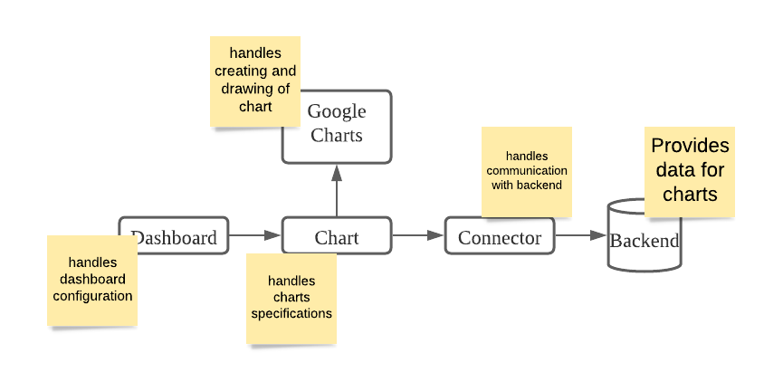
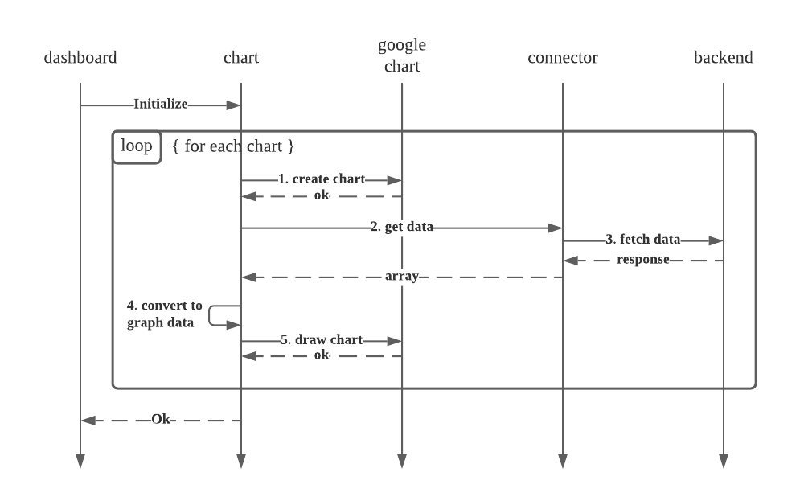
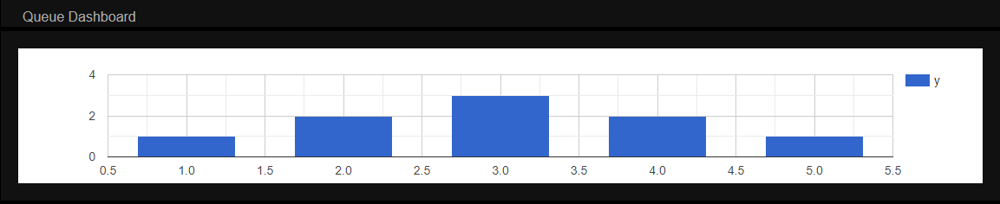
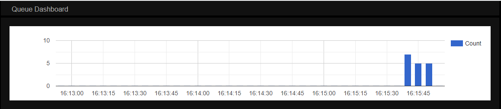

# ST0507 ADES AY21/22 Sem 1 CA1 Website

## Setup

1. Setup the backend your created with your group (The one with your class and group name)
2. Start the Backend by starting the database followed by running the backend.

    ```
    $ npm run start-db

    $ npm run start
    ```

## Run

1. Serve `index.html` on `localhost` and access it via your desired browser
    1. You should see a black page with 2 grey containers

> You can use VSCode's live server or any other method you prefer.

## Instructions

> You are to make changes to this repository and not the backend repository

We will be building a dashboard with a single graph to monitor the number of errors our system encounters.




1. Clone this repository
2. Following the component diagram, we will once again begin with the one without any arrow coming out of it, less the backend, that will be the connector component.
3. Refer to the API documentation of `/stats/errors`, you should notice the following:
    1. Method: `GET`
    2. Path: `/stats/errors`
    3. Query Parameters: `from` and `duration`
    4. Response Body: `Array`
4. Recall that the dashboard will show us data of the past 3 minutes. That means if it is `10:00` now, the `from` parameter should be `09:57` and the `duration` parameter should be `3`
5. Therefore, in order to calculate the `from` parameter, we will need a few things
    1. The current date & time
    2. The `duration`
    3. The ability to minus `duration` from the current date & time
    4. The ability to format the current date & time with the specific format: `YYYY-MM-DDTHH:mm:ss`
6. We know that `duration` is a constant value of `3`, so let us first create a file to store this value. To do that, create a folder named `scripts` and inside this folder, create a file named `commons.mjs` with the following lines:

    ```js
    export const DEFAULTS = {
        duration: 3, // minutes
    };
    ```

7. We can easily use the standard `Date()` library provided by JavaScript to get the current date & time like so:
    ```js
    new Date();
    ```
    > Try it using the console of your browser
8. But it is challenging to use the `Date()` library to minus minutes and to format the date into our desired format. Thus we will use an external library, [`dayjs`](https://day.js.org/)
9. Looking at [dayjs' installation page](https://day.js.org/docs/en/installation/installation) we see this 2 different options:

    1. Node.js
    2. Browser (We will use this)

    > This should make you wonder what is the difference between `Node.js` and `Browser`? Aren't they both `JavaScript`? You can read more about it here: https://nodejs.dev/learn/differences-between-nodejs-and-the-browser

10. In the browser installation page we see that we can either

    1. Save the file locally and import the script OR
    2. Import the script from the internet director (We will use this)

    > Using CDN is typically preferred for static files because
    >
    > 1. It reduces the number of request to your own web server AND
    > 2. CDNs are designed to serve static files quickly using technologies such as caching and serving from servers which are geographically closer to end users.

11. In the `index.html` file, below the `<!-- external scripts -->` comment, add the following script:

    ```html
    <!-- external scripts -->
    <script src="https://unpkg.com/dayjs@1.8.21/dayjs.min.js"></script>
    ```

    This imports the `dayjs` library into our scripts.

12. Now we can write code to generate the `from` parameter. Under the `scripts` folder, create a new file `utils.mjs` with the following lines:

    ```js
    import { DEFAULTS } from './commons.mjs';

    export function makeFromParameter() {
        const { duration } = DEFAULTS;
        const now = dayjs();
        const from = now.subtract(duration, 'minute');
        return [from.format('YYYY-MM-DDTHH:mm:ss'), from, now];
    }
    ```

    > A function can only return a single value, in order to return multiple value, we can do something like putting the multiple values into an array.
    >
    > the `now` and `from` variable will be used at a later step.

13. To test this function, let us first serve `index.html` locally and access it via your desired browser,
14. Open the console and run the following line:

    ```js
    import('./scripts/utils.mjs');
    ```

    This loads the module onto a global variable `utils`.

15. Notice that `import()` returns a promise and the promise result is the imported module. Thus we can chain it to ensure that we access the methods only after the module has been imported.

    ```js
    import('./scripts/utils.mjs')
        .then((utils) => utils.makeFromParameter())
        .then(console.log);
    ```

16. Notice that the date printed is the current date and time in Singapore Time (+08:00), if you read the API documentation, the time should be in GMT time (+00:00). That means that the hours should be backwards by 8 hour.
17. We may be tempted to simply subtract the date by 8 hours, like how we did it with the `duration`. But this would not work as the current date time is dependent on the user's computer setting. If a user's computer is configured to use another timezone, then the offset would be different.
18. Luckily, dayjs provides a UTC plugin which allows us to convert the time to GMT timezone. By reading the [plugin documentation](https://day.js.org/docs/en/plugin/loading-into-browser), we know that we can import the plugin by adding the following script in the `<!-- external script -->` section

    ```html
    <script src="https://unpkg.com/dayjs@1.8.21/plugin/utc.js"></script>
    <script>
        dayjs.extend(window.dayjs_plugin_utc);
    </script>
    ```

19. If you head over to the [`UTC`](https://day.js.org/docs/en/plugin/utc) plugin page, you can observe how it can be used. Let us now modify our `makeFromParameter()` function to make use of the `UTC` plugin:

    ```js
    export function makeFromParameter() {
        ...
        const now = dayjs().utc(); // Add .utc() to the back of dayjs()
        ...
    }
    ```

20. Now that we are able to produce the `from` and `duration` parameter, we can start to send request to the backend.
21. Create a new file `connector.mjs` and include the following lines:

    ```js
    const host = `http://localhost:3000/`;
    const errorChartEndpoint = `stats/errors`;

    export function getErrorChartPayload(from, duration) {
        const url = `${host}${errorChartEndpoint}?from=${encodeURIComponent(from)}&duration=${duration}`;
        return fetch(url).then((response) => response.json());
    }
    ```

22. We can test out this function like how we tested the `makeFromParameter()` function.

    ```js
    let from, duration;
    import('./scripts/utils.mjs')
        .then((utils) => ([from] = utils.makeFromParameter()))
        .then(() => import('./scripts/commons.mjs'))
        .then(({ DEFAULTS }) => ({ duration } = DEFAULTS))
        .then(() => import('./scripts/connector.mjs'))
        .then((connector) => connector.getErrorChartPayload(from, duration))
        .then(console.log);
    ```

    If you have not triggered any error, you should see an empty array.

23. Heading back to the backend folder, we can make use of the HTTP request in `./test/http/errors.test.http` to trigger some 404 errors which would be logged by our system. Send 3 request to trigger 404 errors.
24. Head back to the browser's console and send the request to get Error Chart payload again. This time round, you should observe an array of 3 element.
25. With the connector component completed, we can now move on to the next component, the `Google Chart` component.
26. To be able to make use of the `Google Chart` Library, we first need to import the library. Looking at the [`Google Chart Documentation`](https://developers.google.com/chart/interactive/docs/basic_load_libs), we know that in order to import the library we need to include the following lines at the `<!-- external script -->` section of `index.html`.

    ```html
    <script src="https://www.gstatic.com/charts/loader.js"></script>
    <script>
        google.charts.load('current', { packages: ['corechart'] });
        // google.charts.setOnLoadCallback(drawChart);
    </script>
    ```

    > We are not drawing the charts immediately when the library is loaded, so we can omit the `setOnLoadCallback` function.

27. Looking at the sequence diagram, we can expect that the `Google Chart` component would expose 2 function for each chart.

    1. Create Chart and
    2. Draw Chart

    Since we are expected to draw column charts for the error graph, we will be using Google's Column Chart API.

28. Looking at the [`Column Chart API`](https://developers.google.com/chart/interactive/docs/gallery/columnchart), we can see plenty of example on how to first create a chart. Create a new file `google_chart.mjs` and include the following function:

    ```js
    export function createColumnChart(chartDom) {
        return new google.visualization.ColumnChart(chartDom);
    }
    ```

29. Also looking at the API, we can see how data and options are given to a chart so that the chart can be rendered onto the page. Add the following function into `google_chart.mjs`

    ```js
    export function drawChart(chart, array, options) {
        const data = google.visualization.arrayToDataTable(array);
        chart.draw(data, options);
    }
    ```

30. Time to once again test that we have implemented correctly. In the `index.html` you should observe that the following elements have already been created:

    ```html
    <div id="error-rate" class="chart-container">
        <div class="chart"></div>
        <div class="loading-icon lds-dual-ring" hidden></div>
        <div class="warning-icon" hidden>⚠️</div>
    </div>
    ```

31. The element `div[@id="error-rate"]/div[@class="chart"]` will be the element where the graph will be drawn in. We will select that element and store in a variable `chartDom`.

    ```js
    let chartContainerDom = document.getElementById('error-rate');
    let chartDom = chartContainerDom.querySelector('.chart');
    ```

32. We can also prepare some dummy data to simulate the drawing of the chart, looking at the examples in the documentation, the following should be a good enough sample array and option:

    ```js
    let array = [
        ['x', 'y'],
        [1, 1],
        [2, 2],
        [3, 3],
        [4, 2],
        [5, 1],
    ];

    let options = {};
    ```

33. Putting them together, we can use do the following to test out the creating and drawing of chart:

    ```js
    import('./scripts/google_charts.mjs').then((googleCharts) => {
        const chart = googleCharts.createColumnChart(chartDom);
        googleCharts.drawChart(chart, array, options);
    });
    ```

    You should obtain the following:

    

34. Now that we are able to draw the chart and we are able to fetch data, we can now proceed to implement the `chart` component. Looking at the sequence diagram, we know that each chart has 4 process

    1. create chart
    2. get data
    3. converting to graph data
    4. draw chart

    Everything except for (3) converting to graph data is done by calling the function of another component. So we will first implement this function.

35. Create a new file `charts.mjs` and include the following function:

    ```js
    function getBucketKey(value, bucketSize) {
        return value - (value % bucketSize);
    }

    function makeTimestampBuckets(timestamps, minValue, maxValue) {
        const bucketSize = 5; // This is a constant, it could be defined in DEFAULTS variable in commons.mjs

        const timestampMap = {};
        const timestampKeys = [];
        const minBucketKey = getBucketKey(minValue, bucketSize);
        for (let i = minBucketKey; i < maxValue; i += bucketSize) {
            timestampMap[i] = 0;
            timestampKeys.push(i);
        }
        timestamps.forEach((timestamp) => {
            timestampMap[getBucketKey(timestamp, bucketSize)] += 1;
        });

        const buckets = [['Timestamp', 'Count']];
        timestampKeys.forEach((timestamp) => {
            buckets.push([new Date(timestamp * 1000), timestampMap[timestamp]]);
        });
        return buckets;
    }

    function makeErrorChartPayloadToTimestampBuckets(payload, fromDayJs, toDayJs) {
        const minValue = fromDayJs.unix();
        const maxValue = toDayJs.unix();
        return makeTimestampBuckets(
            payload.map(({ timestamp }) => timestamp),
            minValue,
            maxValue,
        );
    }
    ```

    > Whew, this is a long function, do take some time to trace through and try to understand what is happening in the function.
    >
    > Recall previously in `makeFromParameter` we returned 2 additonal variable `now` and `from`. Those variable will be used as `fromDayJs` and `toDayJs`.

36. Now that we have all the steps, it's time to create the `initialize` function. But before that, we will first define which functions to be called to create and draw the chart. Add the following lines into the `charts.mjs`:

    ```js
    // At the top of the file.
    import { createColumnChart, drawChart } from './google_charts.mjs';
    import { getErrorChartPayload } from './connector.mjs';
    import { makeFromParameter } from './utils.mjs';
    import { DEFAULTS } from './commons.mjs';

    // After: makeErrorChartPayloadToTimestampBuckets
    const charts = [
        // error chart
        {
            options: {},
            containerId: 'error-rate',
            create: createColumnChart,
            getData: getErrorChartPayload,
            convertToGraphData: makeErrorChartPayloadToTimestampBuckets,
            draw: (chart, array) => drawChart(chart, array, this.options),
        },
    ];
    ```

    > This few lines defines the functions we need to call at each step in order to create and draw the error chart. You can later extend this to include other type of graphs.

37. We will now create the `initialize` function, add the following at the bottom of the file:

    > Refer to the sequence diagram, you would notice that the 4 steps is applied for every charts.

    ```js
    export function initialize() {
        charts.forEach(({ containerId, create, getData, convertToGraphData, draw }) => {
            const chartContainerDom = document.getElementById(containerId);
            const chartDom = chartContainerDom.querySelector('.chart');
            const chart = create(chartDom);
            const [from, fromDayJs, toDayJs] = makeFromParameter();
            const { duration } = DEFAULTS;
            getData(from, duration)
                .then((data) => convertToGraphData(data, fromDayJs, toDayJs))
                .then((array) => draw(chart, array));
        });
    }
    ```

38. We can test the correctness by once again importing this module and calling the `initialize` function. (Try to create the script yourself)

    In order to see the bars, you would probably need to trigger some 404 request again.

    

39. And there you have it, you have successfully generated a chart, you can now take a look at the website that will be provided to you to work with for your CA1 here: https://github.com/ades-fsp/2122s1-website
